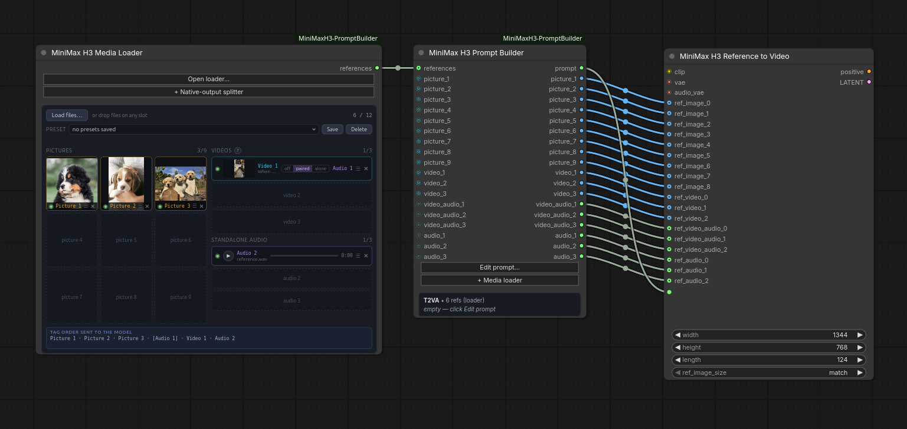
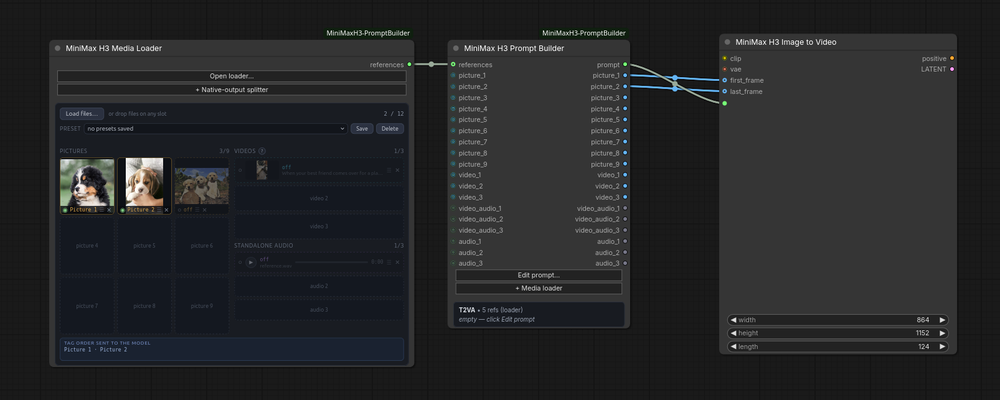
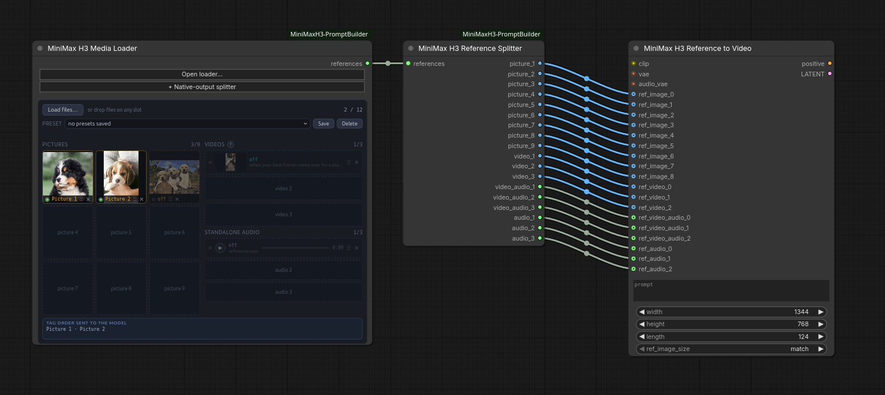
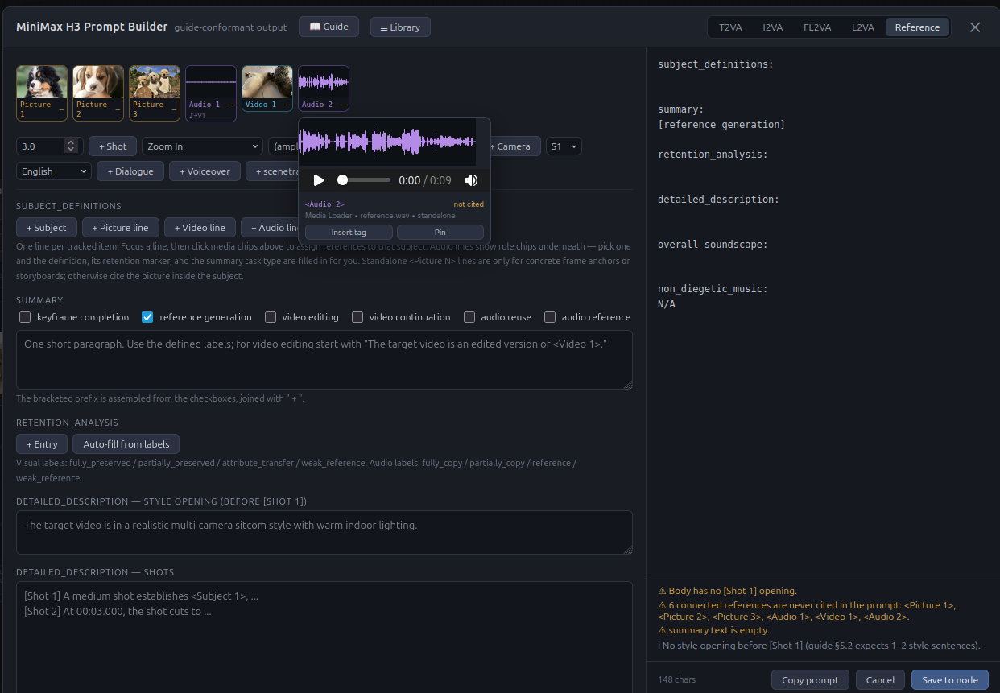
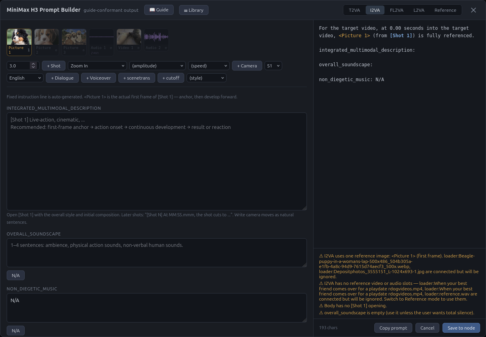
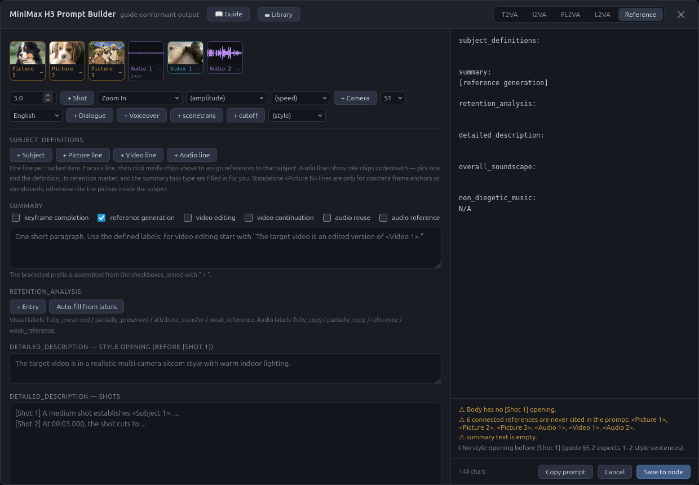

# ComfyUI Fantastic MiniMax H3 Prompt Builder

Guided prompt writing and reference-media handling for the open-weight
**MiniMax H3** video model in ComfyUI.

H3 doesn't want a casual sentence — it wants a structured prompt with named
sections, shot timings, speaker IDs, and tags pointing at your reference media.
MiniMax publishes a written guide for that format, and normally a separate
rewriting model (`H3-Context-IR`) turns your idea into it. That rewriter wasn't
open-sourced. This node pack is the hand-driven replacement: fillable templates
for every mode, live checking against the guide's rules, and a media loader that
keeps your reference tags straight.



*Media Loader → Prompt Builder → MiniMax H3 Reference to Video*



*Media Loader → Prompt Builder → MiniMax H3 Image to Video*



*Media Loader → Reference Splitter → processor. For use without the Prompt
Builder, managing reference media only.*



*Media is displayed while you work. Hover over for previews. Clicking media
automatically adds the tag (like `<Picture 1>`) into the active text field for
you.*

---

## Contents

- [What you get](#what-you-get)
- [Requirements](#requirements)
- [Install](#install)
- [Quick start](#quick-start)
- [Writing a prompt](#writing-a-prompt)
- [Prompt library](#prompt-library)
- [Reference mode](#reference-mode)
- [FAQ: wiring reference media](#faq-wiring-reference-media)
- [Troubleshooting](#troubleshooting)
- [Credits](#credits)

---

## What you get

Three nodes, all under **conditioning → video_models**:

| Node | What it's for |
|---|---|
| **MiniMax H3 Prompt Builder** | The main one. An editor with fillable fields for every prompt mode, checks your work as you type, and outputs the finished prompt. |
| **MiniMax H3 Media Loader** | Drag-and-drop your reference images, videos, and audio. Shows exactly which tag each one will get. |
| **MiniMax H3 Reference Splitter** | Optional. Fans media out into individual slots when you want it to skip the Prompt Builder. |

Highlights:

- **Templates for all five modes** — text-to-video, first frame, first+last
  frame, last frame, and full reference mode.
- **Click-to-insert tags.** Your reference media appears as thumbnails; click
  one to drop `<Picture 2>` into your text. No typing tags by hand.
- **Live checking.** Shot numbering, cut times, dialogue formatting, references
  you connected but never mentioned — flagged while you write, not after a
  failed render.
- **The official guide is built in.** A 📖 button opens the full PDF.
- **Drag-and-drop media** with previews, playback, and reorderable slots.
- **Non-destructive trim and crop** — a popout editor sends just a slice of a
  clip (like its last 3 seconds), or just a region of the frame, without
  touching the file.
- **A prompt library** — save prompts with categories and favourites, then
  search and reload them.
- **Media presets** so you can reload a set of references in one click.

---

## Requirements

- **ComfyUI 0.30.0 or newer** — this is when H3 support landed.
- **The MiniMax H3 models.** Use the `fl2va` checkpoint for text and keyframe
  work, `ref2va` for reference mode. ComfyUI's own H3 templates will set you up.
- **PyAV or ffmpeg** — only needed for reference *videos*. Images and audio work
  without either. There's a good chance you already have this: many ComfyUI
  installs ship with ffmpeg, and PyAV comes along with several common custom
  node packs. Try dropping a video on the Media Loader first — if it's accepted,
  you're set. If not, `pip install av` into your ComfyUI environment is the easy
  route. Either way the node still loads and tells you why videos are
  unavailable, rather than failing when you hit queue.

---

## Install

**Via git**

```bash
cd ComfyUI/custom_nodes
git clone https://github.com/Adudeguyman/ComfyUI-Fantastic-MiniMaxH3-PromptBuilder
```

**Via ComfyUI Manager** — search for "Fantastic MiniMax H3 Prompt Builder" and install.

**Manually** — download the ZIP and extract into `ComfyUI/custom_nodes/` so you
end up with `ComfyUI/custom_nodes/ComfyUI-Fantastic-MiniMaxH3-PromptBuilder/`.

Then **restart ComfyUI completely** — not just a browser refresh. Nodes are only
registered at startup.

To confirm it worked, search the node menu for "MiniMax H3". All three nodes
above should be listed.

---

## Quick start

This is the same for every mode:

1. Add a **MiniMax H3 Prompt Builder**.
2. Click **Edit prompt…**, pick your mode along the top, and fill in the fields.
   The finished prompt builds live in the right-hand panel.
3. Click **Save to node**.
4. Connect the Prompt Builder's `prompt` output to the `prompt` input on
   whichever H3 node you're using:
   - **MiniMax H3 Image to Video** for T2VA, I2VA, FL2VA, and L2VA
   - **MiniMax H3 Reference to Video** for reference mode

   If `prompt` shows as a widget rather than an input, right-click it and choose
   *Convert widget to input*.
5. Set `width`, `height`, and `length` on that node. For first/last-frame modes
   the editor shows the exact frame count to use — H3 only accepts certain
   values, and the editor already rounds to a valid one.
6. Wire up whatever your mode needs:
   - **T2VA** — nothing else; the prompt is the whole input.
   - **I2VA / FL2VA / L2VA** — load your keyframe images with either ComfyUI's
     own **Load Image** nodes or this pack's **Media Loader**, then connect them
     to **Image to Video** like so:
     - **I2VA** — your image → `first_frame`
     - **FL2VA** — first image → `first_frame`, second image → `last_frame`
     - **L2VA** — your image → `last_frame`

     With **Load Image** nodes you have a choice: wire them straight into the
     H3 node, or route them through the Prompt Builder first — into its
     `picture_1` input and back out of the matching output. You can also do
     both, by splitting the connection so the same image reaches the H3 node and
     the builder. Routing through the builder is what gives you previews while
     you write.

     The **Media Loader** does the same job with less wiring: drop your images
     on it, run its single `references` output into the Prompt Builder, and take
     the frames from the builder's `picture_1` and `picture_2` outputs.
   - **Reference mode** — see [Reference mode](#reference-mode) below.
7. Queue it.

The rest of the workflow — loaders, samplers, VAE decode, save — is unchanged
from ComfyUI's built-in MiniMax H3 templates. This pack only replaces how the
prompt gets written.

---

## Writing a prompt

Click **Edit prompt…** to open the editor, then pick a mode along the top:

| Mode | You give it | Good for |
|---|---|---|
| **T2VA** | Just text | Building a scene from scratch |
| **I2VA** | A first frame | Animating forward from an image |
| **FL2VA** | First and last frames | Getting from A to B |
| **L2VA** | A last frame | Working backwards to a known ending |
| **Reference** | Any mix of images, video, audio | Locking a character, style, voice, or motion |

The editor fills in the fixed boilerplate — instruction lines, timing values,
section headers — so you write the actual description and it assembles a
correctly formatted prompt underneath. The right-hand panel shows the finished
prompt live as you type.

**Things the toolbar does for you:** inserts numbered shots with correctly
formatted cut times, writes camera moves as proper sentences, wraps dialogue
with the right language tags and speaker IDs, and drops in reference tags.

**Things it checks:** shots numbered in order, cut times increasing and inside
your video's length, `[Shot 1]` not carrying a timestamp, dialogue tags balanced
and labelled, references you connected but never mentioned, and — in reference
mode — every subject having a matching retention entry.

Amber warnings are advisory and the prompt saves regardless. Red errors are the
ones worth fixing before you render.

**Clear** in the header empties every field and starts a new prompt in the same
mode. It asks first, and the node keeps whatever prompt it already has until you
save — so clearing is only permanent once you press **Save to node**.



*I2VA layout — only the input Picture 1 can be used in I2VA mode. Other media is
disabled. You can rearrange which image is used as Picture 1 on the Media Loader
node: click and drag the ☰ icon. Alternatively, media can be disabled and
enabled by clicking the green dial, which automatically reorders the media
passed to the processing node. NOTE: changing order or disabling media changes
its label for the prompt — it does **not** automatically update your prompt.*

---

## Prompt library

Click **☰ Library** in the editor header to browse everything you've saved.

**Save current prompt** stores what's in the editor under a name, with an
optional category. Saved prompts keep the *editor state*, not just the finished
text — so loading one puts every field back exactly as you left it, ready to
edit. Nothing is re-parsed, so nothing can be misread on the way back in.

In the library you can:

- **Search** by name, category, mode, or the prompt text itself.
- **Filter by category** — type any category name when saving and it becomes
  available in the dropdown.
- **Manage categories** — pick one in the dropdown and click ✎ to rename it
  across every prompt in it, or clear it so those prompts become uncategorised.
  The prompts themselves are never deleted.
- **Recategorise a single prompt** — click its category chip (or `+ category` on
  one without) and set a new one.
- **Star favourites**, which sort to the top of the list.
- **Load** a prompt, replacing what's in the editor (it asks first if you'd be
  overwriting something).
- **Delete** entries you don't need.

Each row shows the mode it was written for, its category, how long ago it was
saved, and the opening of the prompt. Saving again under the same name updates
the entry; saving under a new name after loading one renames it.

Prompts live as individual JSON files in your ComfyUI user directory, so they
survive updates and are easy to back up or share.

---

## Reference mode

Reference mode is the one that takes media — images, video, and audio you want
the model to draw a character, style, voice, or motion from. It uses **MiniMax
H3 Reference to Video** and the `ref2va` checkpoint.

### The short version

1. On the Prompt Builder, click **+ Media loader**. A Media Loader appears,
   already connected.
2. Drop your reference files onto it, or click **Load files…**. Images, video,
   and audio can all go in at once — each lands in the right group.
3. Open **Edit prompt…** and switch to **Reference** mode. Your media now shows
   up as clickable thumbnails; click one to insert its tag into your text.
4. Fill in the six sections, then **Save to node**.
5. Connect the Prompt Builder's media outputs — `picture_1`, `video_1`, and so
   on — to the matching slots on **MiniMax H3 Reference to Video**, alongside
   the `prompt` connection you already made.

### What the media loader shows you

Every reference gets a tag like `<Picture 1>` or `<Audio 2>`, and your prompt
refers to media by those tags. The numbering isn't simply "which slot did I plug
this into" — see [How do tags get their
numbers?](#how-do-tags-get-their-numbers) — so the loader displays the exact tag
order along the bottom of the node, and the editor labels each thumbnail with
the tag it will actually get.

The ✂ button on any video or audio row trims what's sent to a start–end range
in seconds — the file itself is untouched, and the counters and 15-second
budgets track the trimmed span. `last 2s` / `last 3s` shortcuts grab a clip's
tail in one click, which is exactly what video continuation wants. Over-long
clips can be brought inside the budget the same way instead of re-exporting.

Videos that carry sound get an extra control for whether that soundtrack is
treated as part of the video or as a separate audio reference. The **?** button
by the videos heading explains the choice, and there's a
[summary in the FAQ](#what-do-off--paired--alone-do).

### Trimming and cropping clips

The ✂ button on any video or audio row opens a popout editor. **The file on
disk is never modified** — everything is applied when the clip is decoded, so
the same file can be treated differently in another workflow, and Reset gives
you the whole clip back.

For both video and audio you get a timeline with draggable start and end
handles; the preview follows whichever handle you're dragging, so you can find
a cut by eye. Audio shows its waveform under the ruler. Play loops just the
selected span, and the readout warns when the kept span drops under the model's
2-second minimum.

Video additionally gets **▣ Crop**: drag a rectangle (with rule-of-thirds
guides) to send only part of the frame — freeform or locked to 1:1, 16:9, or
9:16 — with the resulting pixel size shown live. Handy for cutting a subject
out of wider footage instead of re-exporting.

Two things it's for:

- **Getting inside the budget.** A 40-second song or a long take doesn't need
  re-exporting; trim it to the seconds you want. The file counter, the ♪ audio
  counter, and the 2–15s and 15s-total checks all measure the *trimmed* span.
- **Continuing a video.** `2s⇥` and `3s⇥` set the trim to the clip's final
  seconds in one click, which is exactly what a continuation reference wants —
  the motion and audio leading into the new clip, without spending your whole
  budget on footage the model doesn't need.

The scissors glow amber when a trim is active, and the trim travels with media
presets and with saved workflows.

One wrinkle worth knowing: a trim applies to the *item*, so trimming a video
trims its frames and its paired soundtrack together. To keep the full video but
only a few seconds of its audio, set the video's audio to `off` and load the
audio separately, then trim that copy.

You can also skip the Media Loader entirely and wire your own loaders — the
[FAQ](#do-i-have-to-use-the-media-loader) covers every route.



*Reference mode — all six sections, with every connected reference available to
cite.*

### Presets

The Media Loader can save your current set of references — which files, their
order, and each video's audio setting — under a name, and reload it later from
the dropdown.

Presets point at files you already uploaded rather than copying them, so saving
and loading is instant. If you later delete one of those files, loading the
preset skips it and tells you which one is missing. Deleting a preset never
deletes your media.

---

---

## FAQ: wiring reference media

This is the fiddly part, so here's the whole picture.

### Do I have to use the Media Loader?

No. There are three ways to get media in, and they all work:

1. **Media Loader → Prompt Builder.** One cable. Easiest, and previews plus tag
   numbering come free.
2. **Your own loaders → Prompt Builder.** Wire `LoadImage` and friends into the
   Prompt Builder's `picture_1`, `video_1`, `audio_1` inputs.
3. **Straight to the native node.** Skip this pack's media handling entirely and
   wire your loaders directly into **MiniMax H3 Reference to Video**. You still
   get a well-formed prompt; you just won't get thumbnails in the editor.

Options 1 and 2 mix freely. If a slot has its own input wired, that wins;
anything else falls back to the Media Loader's bundle.

### Which output goes where?

The Prompt Builder has a `prompt` output plus one output per media slot.

| From Prompt Builder | To MiniMax H3 Reference to Video |
|---|---|
| `prompt` | `prompt` |
| `picture_1` … `picture_9` | `ref_images` slots |
| `video_1` … `video_3` | `ref_videos` slots |
| `video_audio_1` … `video_audio_3` | `ref_video_audios` slots |
| `audio_1` … `audio_3` | `ref_audios` slots |

The native node's slots start at 0 while ours start at 1, so `picture_1` goes to
`ref_image_0`. Keep them in the same order.

### Then what's the Reference Splitter for?

Only for when you want media to reach the sampler *without* going through the
Prompt Builder — for instance if you keep the builder off to one side. Media
Loader → Splitter → native node. If you're already routing media through the
Prompt Builder, you don't need it. There's a button on the Media Loader that
adds one, wired up.

### How do tags get their numbers?

This is the one that trips people up, so it's worth reading.

H3 numbers references **by the order they arrive**, not by which slot they're
plugged into. Two consequences:

- **Gaps close up.** If you only fill `picture_2` and `picture_5`, they become
  `<Picture 1>` and `<Picture 2>`.
- **A video's soundtrack takes a low audio number.** It's presented right before
  its own video, so with one video (with sound) plus one standalone audio clip,
  the soundtrack is `<Audio 1>` and the standalone clip is `<Audio 2>` — even
  though the standalone one might feel like it should come first.

You don't have to work this out yourself. The Media Loader shows the exact tag
order along the bottom of the node, and the editor's thumbnails are labelled
with the tag each one will actually get. Trust those over intuition.

### Why is a video's audio a separate thing at all?

ComfyUI has no single "video with sound" type, so frames and audio travel on
separate wires. The Media Loader splits it for you automatically when you drop
in a video file. If you're wiring your own loaders, you'll need one that gives
you frames and audio separately.

The model treats them as one thing internally — the separation is just plumbing.

### What do off / paired / alone do?

That's the little control on a video row when the file has sound. There's a **?**
button next to the videos heading that explains it in the node, but in short:

- **paired** — the sound belongs to this footage. Use it for on-screen dialogue
  where lip sync matters, action sounds that need to land on the right frames,
  or when you're keeping a source video's original audio.
- **alone** — you want the audio as a *reference* rather than as this clip's
  soundtrack: borrowing a voice, a music style, some ambience. Also the right
  pick when you're not reusing the video's visuals in sync.
- **off** — ignore the audio entirely.

### Why does one video count as two files?

H3 takes at most 12 references in total, and a video's split-off soundtrack is
its own reference. So a video with `paired` or `alone` audio uses two of your
twelve. Set it to `off` and you get one back.

It also spends part of a second budget: H3 accepts **three audio clips**, and a
split soundtrack is one of them even though it travels in a different input
group on the native node. Three videos with their sound enabled therefore use
your whole audio allowance. The loader shows both counters — files and ♪ audio —
and warns when either is exceeded.

Reference clips should also run 2–15 seconds each, and — this is the one people
miss — **15 seconds is the total across all clips of a type, not a per-clip
allowance**. Three 15-second audio clips is 45 seconds and three times over
budget; three clips only fit if they average about five seconds each. A split
soundtrack spends from both totals at once: a 12-second video with its audio on
uses 12 of your 15 video seconds *and* 12 of your 15 audio seconds, leaving 3
seconds of audio for anything else.

Audio also can't be sent without at least one image or video alongside it.

The loader flags all of these, and the ✂ trim is usually the fix — see
[Trimming and cropping clips](#trimming-and-cropping-clips).

Go over twelve and you get a red warning. The node deliberately won't drop
anything for you — removing a reference renumbers every tag after it, which
would quietly invalidate tags already written into your prompt.

### Does switching mode change what gets sent?

No — the Prompt Builder passes connected media through unchanged in every mode.
Which references a mode can *use* is shown in the editor: unusable media is
greyed out in the rail, can't be inserted, and the checks list exactly what will
be ignored. If media is connected that the saved mode can't use, a note is
printed to the console at run time, but nothing is silently dropped.

To stop something reaching the model, switch it off with the ◉ toggle on the
Media Loader or disconnect it — an explicit action, visible in the panel,
rather than a side effect of changing mode.

### Can I wire every output once and leave it?

Yes — that's the intended way to work. Connect all of the Prompt Builder's media
outputs to the matching slots on **MiniMax H3 Reference to Video** once, and
leave the workflow alone.

Slots with nothing in them pass through empty, and the H3 node skips them. The
tags close up around whatever is actually present, so three images in slots 1, 2
and 3 are `<Picture 1>`–`<Picture 3>` whether or not the other six are wired.

That pairs with the ◉ toggle on the Media Loader: rather than unplugging cables
between runs, switch an item off and it stops reaching the model — the tag
numbering adjusts, and the Prompt Builder's checks update to match.

### What if I connect an image but never mention it in the prompt?

Nothing errors, but it does affect the result. The image is still handed to the
model, labelled, and taken into account — you've just given it no instructions
about what to do with it. It can bleed into the output in ways you didn't ask
for, and it costs render time and VRAM on every step.

The editor flags this: a reference thumbnail showing an amber dash instead of a
count hasn't been mentioned yet. Either write it into your description or
disconnect it.

### Where do first and last frames go for the non-reference modes?

Keyframes work differently from references. In I2VA, FL2VA, and L2VA your images
are exact frames of the finished video, so they go to the `first_frame` and
`last_frame` inputs on **MiniMax H3 Image to Video** — not to the `ref_images`
slots, which exist only on the reference node and mean "here's something to draw
from", not "here's a frame".

Either loader works. Previews in the editor come from routing an image through
the Prompt Builder — which you can do with a **Load Image** node just as well as
with the Media Loader — so the Media Loader's advantage is convenience rather
than capability. See [Quick start](#quick-start) for the wiring.

These modes take one image each, except FL2VA which takes two. Wire in more and
the editor tells you exactly which ones will be ignored.

### My video length and the prompt disagree

For first/last-frame modes the prompt states when the last frame lands, so it
has to match the length you're actually generating. The editor shows the correct
frame count for your chosen end time — put that number into the native node's
`length`. H3 only accepts certain frame counts, and the editor already rounds to
a valid one.

---

## Troubleshooting

**The nodes don't appear.** ComfyUI needs a full restart, not a page refresh.
Check the startup console for errors mentioning MiniMaxH3.

**I updated but nothing changed.** ComfyUI caches extension files aggressively.
Open DevTools (F12), tick *Disable cache* in the Network tab, and reload with it
open. If a node's *outputs* look wrong specifically, that's a restart issue
rather than a browser one — and nodes already placed in a workflow keep their
old slots, so delete and re-add them after an update.

**Videos are rejected.** Neither PyAV nor ffmpeg was found. Many ComfyUI installs
already include ffmpeg, so this is worth a check before installing anything: if
ffmpeg isn't on your PATH, `pip install av` into your ComfyUI environment is the
simplest fix.

**A button does nothing.** Open the browser console (F12) and click it again —
any failure prints there. The Media Loader also has an **Open loader…** button
that works independently of the on-node panel.

**Something looks squashed or overlapping.** This pack works with both the
classic node renderer and Nodes 2.0. If a panel misbehaves in one of them, the
modal buttons (**Edit prompt…**, **Open loader…**) always work regardless.

---

## Credits

Prompt structure follows MiniMax's official *Video Prompt Writing Guide*, which
ships with this pack — click 📖 in the editor to read it.

Built against ComfyUI's native MiniMax H3 support.

## License

MIT
